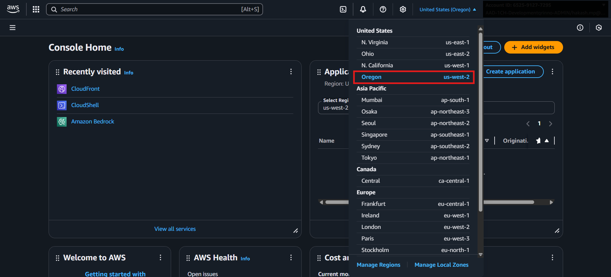
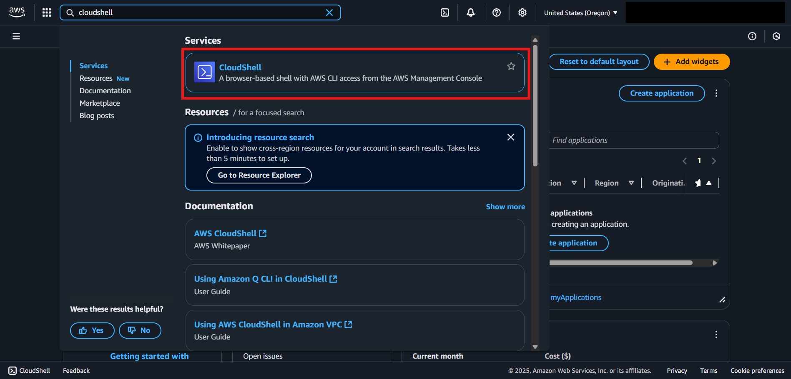
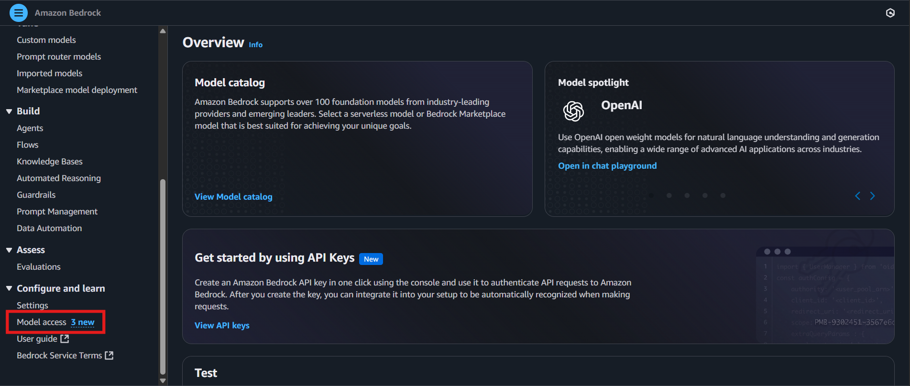
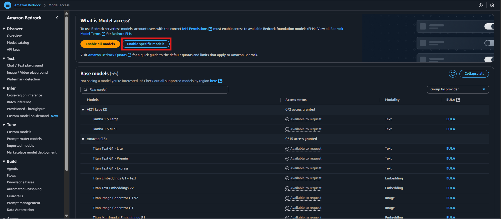
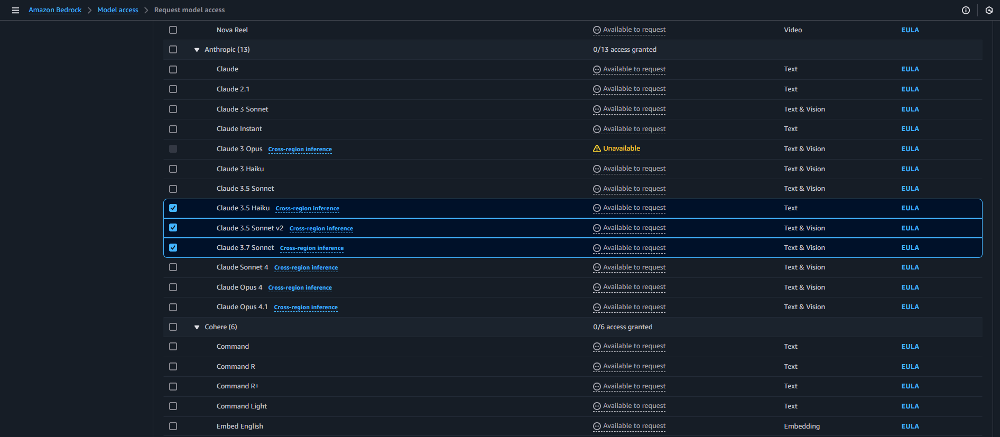
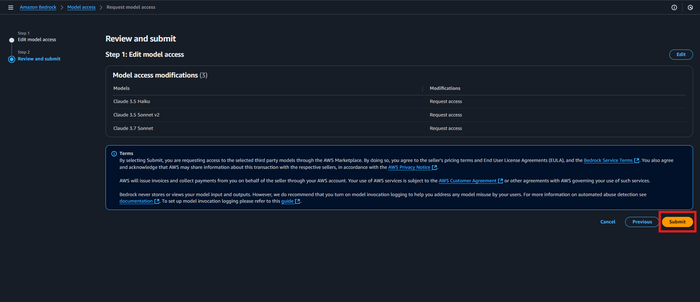
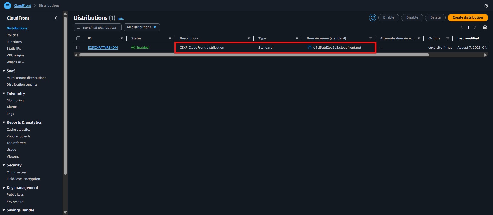

# TextOps CDK Deployment Guide

## Overview

**TextOps** is an intelligent document processing platform that harnesses AI-powered OCR to transform how organizations capture, interpret, and manage information. Built on AWS services, it can process a wide range of document formats and languages—whether structured business forms, scanned handwritten notes, or multilingual contracts—turning complex, unstructured inputs into clean, actionable data.

> **Disclaimer**: This CDK setup is strictly configured for deployment in the `us-west-2` (Oregon) AWS region. Deploying to other regions may result in errors or incompatibility.

---

## Prerequisites

Before deploying TextOps, ensure the following:

* You have access to the target AWS account.
* You are working in the **`us-west-2`** region.
* You have a valid GitHub Personal Access Token (PAT) for accessing the source repository.

---

## Deployment Steps

### 1. Login to the AWS Console

Log in to the designated AWS account using IAM credentials or SSO as instructed.

### 2. Set the Region

In the AWS Console, select **US West (Oregon) – `us-west-2`** from the region dropdown.

> This region is required for all services and integrations in the CDK stack.



---

### 3. Launch AWS CloudShell

From the AWS Console, open the **CloudShell** environment.

> CloudShell includes all required tools pre-installed and avoids local configuration overhead.



---

### 4. Clone the CDK Repository

```bash
git clone --branch cexp-ocr https://github.com/1CloudHub/DevCraft-in-a-Box.git CEXP
```

> Clones the specified branch of the TextOps CDK infrastructure repository.

---

### 5. Export GitHub Token

```bash
export GITHUB_TOKEN={pat_token}
```

> Exports the GitHub token as an environment variable for private repository access.

---

### 6. Install AWS CDK CLI

```bash
sudo npm install -g aws-cdk
```

> Installs the AWS CDK CLI globally in the CloudShell session.

---

### 7. Install Python Dependencies

```bash
cd CEXP
pip install --user -r requirements.txt
```

> Installs the Python dependencies required by the CDK app.

---

### 8. Bootstrap the CDK Environment

```bash
cdk bootstrap
```

> Sets up initial infrastructure required for deploying CDK stacks.

---

### 9. Deploy the CDK Stack

```bash
cdk deploy
```

> Provisions the necessary AWS resources to run the TextOps application.

---

## Post Deployment Steps

### 10. Set Up Textract and Bedrock

If your deployment includes AI model integrations:

* Navigate to **Amazon Bedrock** > **Model Access**
* Request access to relevant models like:

  ```
  - Claude 3.5 Sonnet V2
  ```

> Approval might take a few minutes depending on your AWS account.






---

### 11. Retrieve the Application URL

Go to the **CloudFront** service:

* Locate the distribution created by the deployment.
* Copy the **Domain Name** under general settings.

> This domain will serve as your live application URL.



---

## Accessing TextOps

Once CloudFront is active and model access (if needed) is approved:

* Visit the application URL
* Begin uploading documents for intelligent processing

Enjoy seamless OCR and document processing powered by AI.

---

## About TextOps

At its core, TextOps automates data extraction through advanced AI-based OCR pipelines, supporting diverse inputs such as PDFs, scanned images, and structured templates. The platform integrates human-in-the-loop review workflows, ensuring that critical documents undergo expert validation before finalization. This combination of AI efficiency and human oversight delivers both speed and accuracy, reducing manual effort while maintaining the highest quality and compliance standards.


---

## Legal Notice

© 1CloudHub. All rights reserved.

The materials and components herein are provided for demonstration purposes only. No portion of this project may be implemented in a live or production environment without prior technical assessment, security clearance, and explicit approval from 1CloudHub

---
