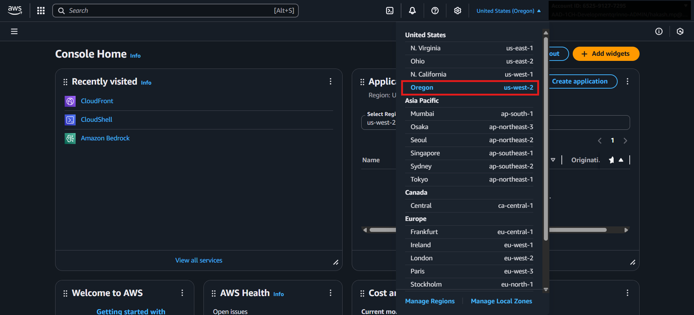
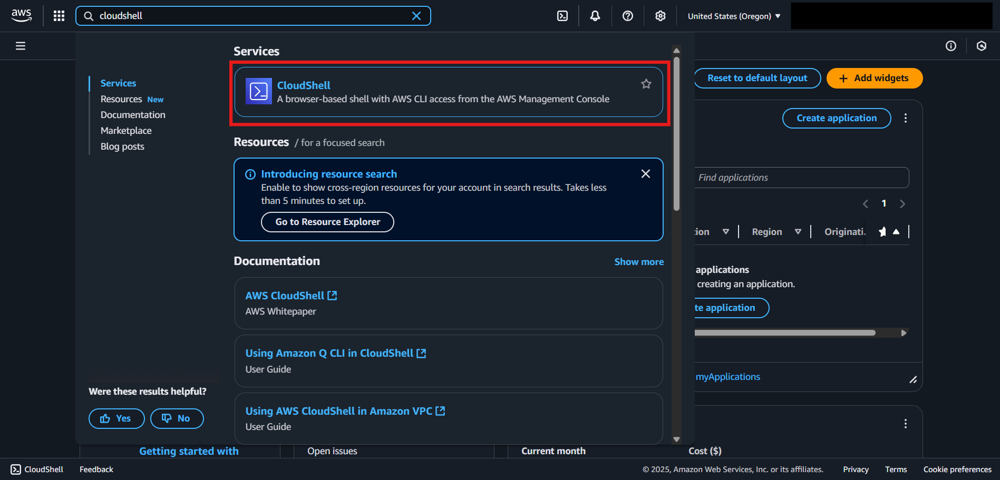
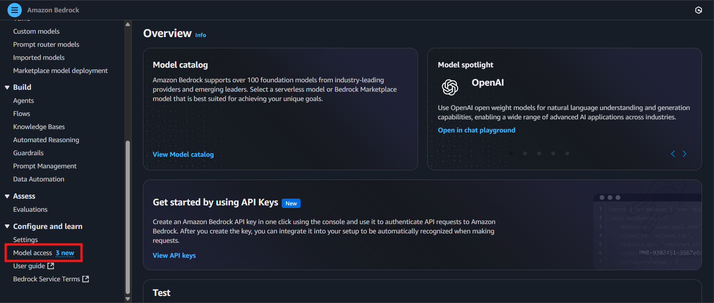
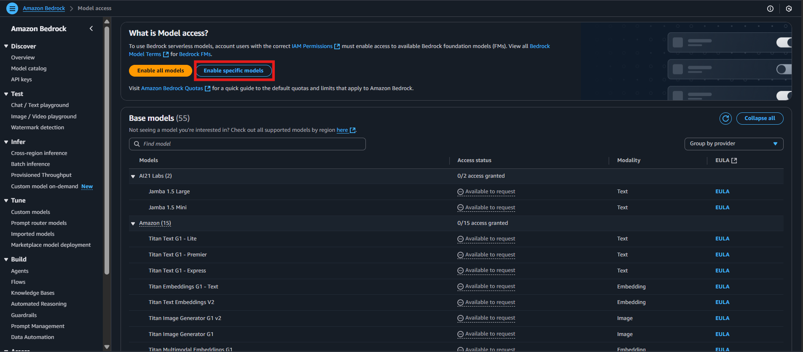
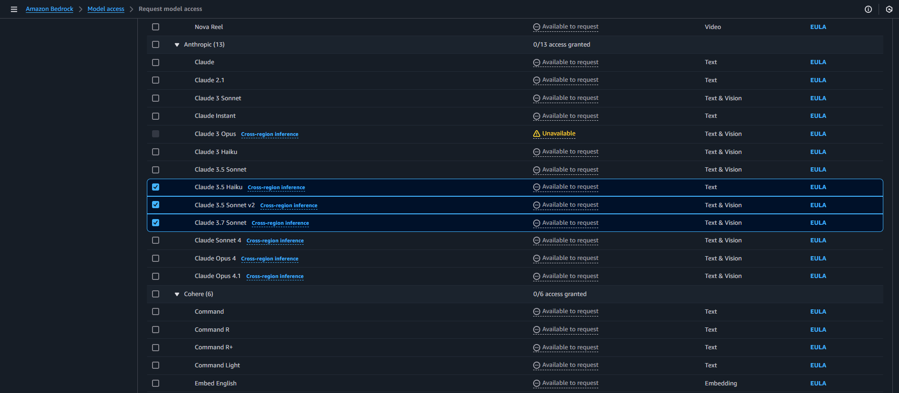
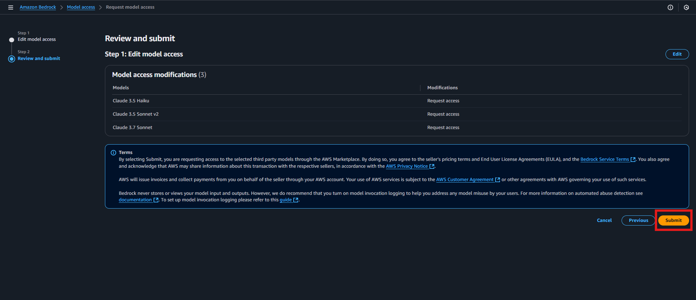
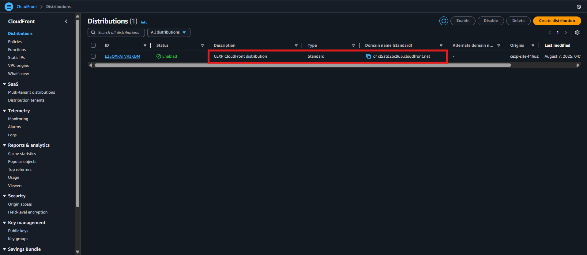
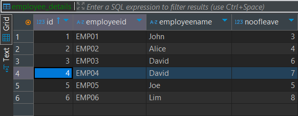

# Connect Xperience CDK Deployment Guide

## Overview

**Connect Xperience** is a multilingual Conversational AI platform designed for both internal teams and customer-facing agents. Powered by Generative AI and built on Amazon Bedrock, it enables seamless knowledge access by allowing users to query and explore information through natural, context-rich dialogue—driving faster resolutions, improved accuracy, and enhanced customer experiences.

> **Disclaimer**: This CDK setup is strictly designed and tested for the `us-west-2` region (Oregon). Please ensure that all resources are deployed only within this region to avoid compatibility issues.

---

## Prerequisites

Before beginning the deployment process:

* Ensure you have access to the correct AWS account.
* You must have a valid GitHub PAT (Personal Access Token) with repository read access.
* You must be using the **`us-west-2`** AWS region.

---

## Deployment Steps

### 1. Login to the AWS Console

Log in to the provided AWS account using the IAM credentials or SSO as per the shared instructions.

### 2. Set Region to `us-west-2`

Navigate to the region selector in the AWS Console and ensure that **`US West (Oregon) - us-west-2`** is selected.

> This is critical, as all the CDK resources are scoped and supported only in this region.



---

### 3. Open AWS CloudShell

Launch the AWS CloudShell service from the AWS Console.

> CloudShell provides a pre-configured environment with AWS CLI and CDK support, making it ideal for deployments.



---

### 4. Clone the Repository

```bash
git clone --branch mini-cexp https://github.com/1CloudHub/DevCraft-in-a-Box.git CEXP
```

> Clones the specific branch of the Connect Xperience CDK repository to your CloudShell environment.

---

### 5. Export GitHub Token

Replace `{pat_token}` with the appropriate value.

```bash
export GITHUB_TOKEN={pat_token}
```

> Sets your GitHub token in the current session, required for any actions needing GitHub access during deployment.

---

### 6. Install AWS CDK CLI

```bash
sudo npm install -g aws-cdk
```

> Installs the AWS CDK Command Line Interface globally in CloudShell.

---

### 7. Install Python Dependencies

```bash
cd CEXP
pip install --user -r requirements.txt
```

> Installs the required Python packages for the CDK app to function properly.

---

### 8. Bootstrap CDK

```bash
cdk bootstrap
```

> Prepares your AWS environment for deploying CDK applications by provisioning necessary resources like the CDK toolkit stack.

---

### 9. Deploy the Stack

```bash
cdk deploy
```

> Deploys the defined CDK infrastructure into your AWS account. This may take several minutes. Wait until the deployment completes successfully.

---

## Post Deployment Steps

### 10. Request Model Access in Bedrock

Navigate to the **Amazon Bedrock** service in the AWS Console.

* Open the **Model access** tab.
* Request access to the following models:

  ```
  - Claude 3.5 Sonnet V2
  - Claude 3.5 Haiku
  - Claude 3.7 Sonnet
  - Amazon Rerank
  - Amazon Titan Embedding V2
  ```

> It may take a few minutes for the model access to be approved.





---

### 11. Get the Application URL

Navigate to the **CloudFront** service.

* Select the newly created distribution.
* Copy the **Domain Name** listed under **General settings**.

> This is your application's public URL. Note that it may take **5–6 minutes** post-deployment for the CloudFront distribution to become active.



---

## Accessing the Application

Once the CloudFront distribution is active and model access is approved, open the copied domain name in your browser to start using **Connect Xperience**.

Here is the sample document to test out:
- [Employee Welfare Policy (DOCX)](./assets/Employee_welfare_policy_SW.docx)

FAQs based on the Document:
```text
1. Can I take casual leave before/after weekends?
2. What documents do I need to apply for medical leave?
3. Is Maternity Leave applicable for contract staff?
4. When is LOP is applicable
5. Explain about the absence and disciplinary rules
```
## AWS Bedrock Agent Setup Guide

Welcome! This guide will walk you through setting up your HR Leave Assistant agent step-by-step. Don't worry if you're new to AWS Bedrock—just follow along at your own pace.

### Getting Started

1. **Access the Bedrock Console**
   - Log in to your AWS Console
   - Navigate to Amazon Bedrock
   - Click on **Agents** in the left sidebar

### Creating Your Agent

2. **Set Up Basic Details**
   - Click **Create Agent**
   - Enter a meaningful name for your agent (e.g., "HR Leave Assistant")
   - For the model, we recommend selecting **Anthropic's Claude 4.0 Sonnet** for optimal performance

3. **Configure Agent Instructions**
   - In the Instructions section, paste the agent instruction prompt provided to you
   - This helps your agent understand how to assist employees with leave requests
   - **Save** the Configurations here.

### Adding Knowledge Base

4. **Connect Your Knowledge Base**
   - Click **Add Knowledge Base**
   - Select the knowledge base named **cexp-kb-xxxx** from the list
   - Add the knowledge base instruction prompt provided to you
   - This allows your agent to reference company leave policies
   - **save** the configuration here.

### Setting Up Actions

5. **Create an Action Group**
   - Click **Add Action Group**
   - Name it **Employee_Action_Group**
   - For **Action group type**, select **"Define with API Schema"**

6. **Configure Lambda Integration**
   - For **Action Group Invocation**, choose **"Select an existing Lambda function"**
   - Select the Lambda function named **Employee_Lambda-xxxx**

7. **Add API Schema**
   - For **Action group schema**, choose **"Define via in-line schema editor"**
   - Paste the OpenAPI schema provided to you in the editor

### Finalizing Your Setup

8. **Save and Prepare**
   - Click **Save and Exit** to return to the main agent page
   - Review your configuration to ensure everything looks correct
   - Click **Save** to preserve your changes
   - Click **Prepare** to get your agent ready for use

That's it! Your HR Leave Assistant is now ready to help employees with their leave requests.

Here is the Employee Details:


| Employee ID | Employee Name | No. of Leave |
| ----------- | ------------- | ------------ |
| EMP01       | Alice         | 7            |
| EMP02       | John          | 3            |
| EMP03       | Peter         | 9            |
| EMP04       | David         | 5            |
| EMP05       | Joe           | 4            |
| EMP06       | Tom           | 8            |
| EMP07       | Garry         | 4            |
| EMP08       | Lim           | 2            |
| EMP09       | Harry         | 5            |
| EMP10       | Robert        | 12           |

### Knowledge Base Instruction
```text
This knowledge base contains employee leave policies, guidelines, and procedures. If information is not in the knowledge base, acknowledge the limitation and suggest contacting HR directly.
```

### Agent Instructions
```text
You are an HR Leave Assistant that helps employees check leave balances and submit leave requests.

Your capabilities:
- Check leave balances for employee with their employee ID
- Process new leave requests with employee ID, reason, and number of days
- Answer leave policy questions using the knowledge base

Always:
- Ask for employee ID when needed
- Before calling a action group/ tool always collect the necessary inputs
- Confirm leave request details before submitting
- Provide remaining balance after processing requests
- Reference leave policies from the knowledge base when answering policy questions

DO NOT Reveal any internal tools details. Always collect the Inputs in a user friendly manner
Keep responses professional, concise, and helpful.
```

### Action Group Schema
```text
{
    "openapi": "3.0.0",
    "info": {
        "title": "HR Leave Portal API",
        "version": "1.0.0",
        "description": "APIs for fetching Employee Leave details"
    },
    "paths": {
        "/leave": {
            "get": {
                "summary": "Get leave details of a single employee",
                "description": "Fetches the leave information for a specific employee using their Employee ID.",
                "operationId": "getEmployeeLeave",
                "parameters": [
                    {
                        "name": "empId",
                        "in": "query",
                        "required": true,
                        "schema": {
                            "type": "string"
                        },
                        "description": "Unique ID of the Employee whose leave details are to be fetched."
                    }
                ],
                "responses": {
                    "200": {
                        "description": "Successfully retrieved leave details for the specified employee",
                        "content": {
                            "application/json": {
                                "schema": {
                                    "type": "object",
                                    "properties": {
                                        "employeeName": {
                                            "type": "string",
                                            "description": "Full name of the employee"
                                        },
                                        "employeeID": {
                                            "type": "string",
                                            "description": "Unique ID of the Employee"
                                        },
                                        "NoOfLeave": {
                                            "type": "integer",
                                            "description": "Number of available leaves for the employee"
                                        }
                                    },
                                    "required": ["employeeName", "employeeID", "NoOfLeave"]
                                }
                            }
                        }
                    },
                    "404": {
                        "description": "Employee not found"
                    }
                }
            },
            "post": {
                "summary": "Process/apply a new leave request of an employee",
                "description": "Creates/applies a new leave request for an employee",
                "operationId": "CreateLeave",
                "requestBody": {
                    "required": true,
                    "content": {
                        "application/json": {
                            "schema": {
                                "type": "object",
                                "properties": {
                                    "empId": {
                                        "type": "string",
                                        "description": "Unique ID of the Employee."
                                    },
                                    "reason": {
                                        "type": "string",
                                        "description": "Reason for leave"
                                    },
                                    "noOfDays": {
                                        "type": "integer",
                                        "description": "Number of days requested for leave"
                                    }
                                },
                                "required": ["empId", "reason", "noOfDays"]
                            }
                        }
                    }
                },
                "responses": {
                    "200": {
                        "description": "Successfully created leave request",
                        "content": {
                            "application/json": {
                                "schema": {
                                    "type": "object",
                                    "properties": {
                                        "message": {
                                            "type": "string",
                                            "description": "Success or error message"
                                        },
                                        "remaining_balance": {
                                            "type": "integer",
                                            "description": "Remaining leave balance of the employee"
                                        }
                                    },
                                    "required": ["message", "remaining_balance"]
                                }
                            }
                        }
                    }
                }
            }
        }
    }
}
```

Enjoy the application experience.

---

## About Connect Xperience

This platform empowers users to upload documents and instantly interact with them through an intelligent assistant that understands context, retrieves precise information, and responds in the user’s preferred language. Whether it’s for internal knowledge support or customer engagement, Connect Xperience delivers relevant, accurate answers that bridge the gap between complex data and clear communication.

---

## Legal Notice

© 1CloudHub. All rights reserved.

The materials and components herein are provided for demonstration purposes only. No portion of this project may be implemented in a live or production environment without prior technical assessment, security clearance, and explicit approval from 1CloudHub

---